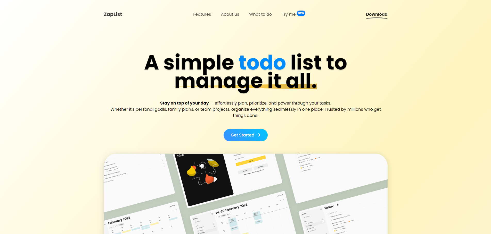

# ZapList – A Simple To-Do List

**Keep track of what you need to do. Get it done.**

ZapList is a to-do list app that helps you stay organized without getting in your way. You can use it to write down tasks, set reminders, and check things off as you go. It's useful for all kinds of things — planning your day, keeping up with work, remembering chores, or managing homework.

There’s nothing complicated about it. Just open the app, add what you need to do, and get started. You can sort your tasks, mark the important ones, and see what’s done and what’s left.

ZapList is built to be clear, easy to use, and helpful — no extra stuff you don’t need just a simple way to stay on top of things.

## Example - v1.0.1
